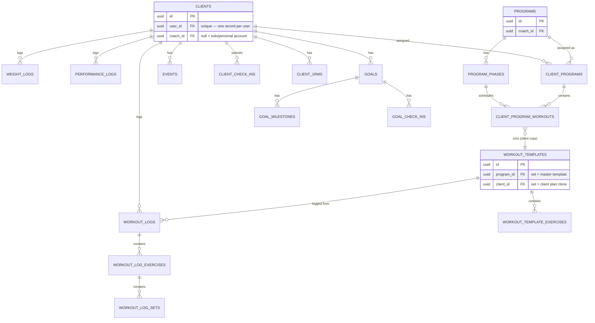
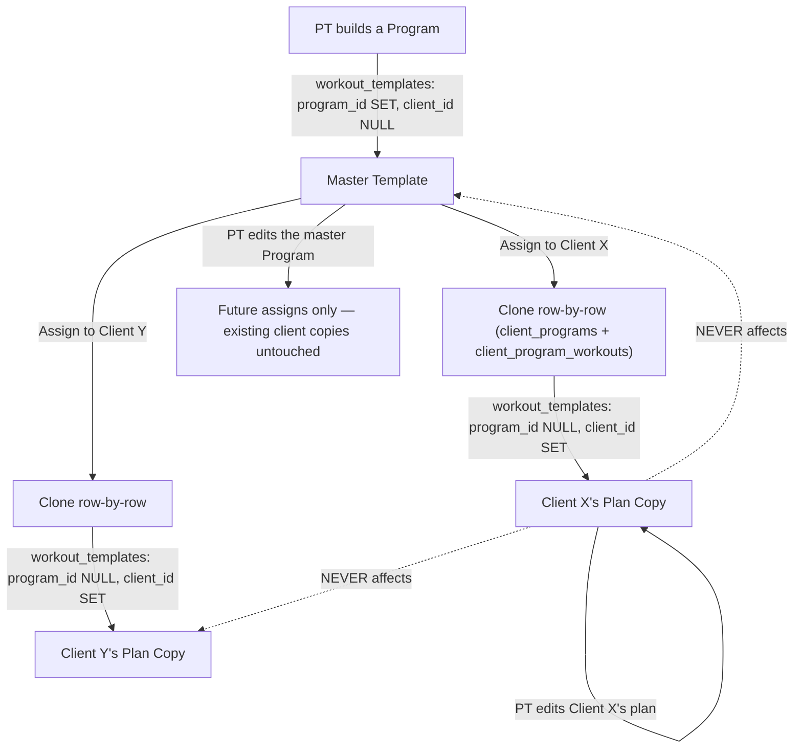
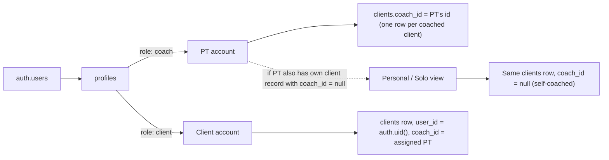
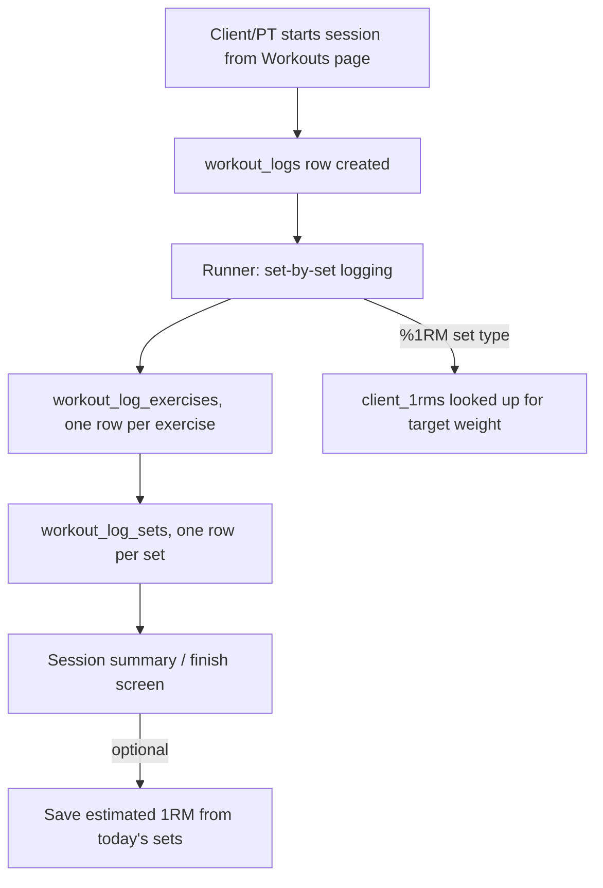

# Schema

Source: the Vault's `data-model.md`, migrated in full 2026-09-15. This is the canonical schema
reference — previously `architecture.md`/`technical-debt.md`/`handover.md` all flagged "no
canonical schema exists," which was true of the repo but not of the Vault. That gap is closed now.

The source of truth for actual live constraints is still Supabase itself (`information_schema`),
not this file — this is the design reference, kept in sync manually. Any schema change (new table,
new FK, renamed column) should update this file in the same commit as the migration, per
[decisions.md](decisions.md)'s documentation-maintenance rule.

## Core entity relationships

## The two-level editing model (the part that matters most)

The single highest-risk area in the schema — getting it wrong means one client's edit silently
changes another client's plan, or vice versa.

**Rule:** `program_id` set + `client_id` null = master. `program_id` null + `client_id` set =
personal copy. Never both set, never both null for a real template (standalone templates are both
null). No auto-renaming — template names only change manually, which is what lets "apply to all
sessions named X" work reliably.

**A third state exists and is not covered by the rule above** (per the 2026-08-12 architecture
audit, `docs/archive/architecture-audit-2026-08-12.md`): `generated_from_phase_id` set, with both
`program_id`/`client_id` null — a periodization-generated week-clone. Depended on directly by
`generatePhasePeriodization`/`_refreshProgramTemplates` in `app-programs.js`. Not independently
re-verified in this migration; flagged as a known doc gap in the source itself, carried forward
rather than silently patched.

**"No auto-renaming" also has an undocumented carve-out** (same audit): periodization week-clones
ARE auto-renamed with a `— W{n}` suffix, stripped for display in 3 places — verified by that audit
as intentional and load-bearing, not a bug.

## Account types / roles

**Key facts:**
- `clients.user_id` has a unique constraint — exactly one client record per user, ever.
- Solo/Personal is **not** a separate record — it's the same client record with `coach_id` nulled.
- `window._masterAccount` = true when the logged-in coach also has any client record (coached or
  personal).
- RLS anchor for solo: `client_id in (select id from clients where user_id = auth.uid() and coach_id is null)`.

## Workout logging flow (runner)

**Two corrections to this diagram, per the 2026-08-12 audit** (not independently re-verified here):
the `workout_logs` row is only created at **save** time, not session start — the runner is
localStorage-only until then, by the runner module's own header comment. And "Save estimated 1RM"
is fully shipped (`showPostSessionOneRMModal` et al.), not planned/dashed as the original diagram
marked it.

## Schema changes 2026-07-12 → 2026-08-24

Reconciled 2026-08-23/24 by reading `scripts/*.sql` directly, after this file had gone unmaintained
through 16 migrations. This migration adds the newer `scripts/*.sql` files (through
`add-template-updated-at-2026-09-04.sql`) that landed after this reconciliation — see
[architecture.md](architecture.md) for the full, currently-verified list of 20 migration files.

**`profiles`** — account-shape columns:

| Column | Added | Notes |
|---|---|---|
| `starter_seeded` | 2026-07-12 | bool, default false — gates the new-coach first-login seed |
| `solo_only` | 2026-07-24 | bool, default false — locks an account to personal-only, no coach dashboard |
| `weight_unit` | 2026-07-24 | `kg`/`lb`, default kg |
| `jump_height_unit` | 2026-07-24 | `cm`/`in`, default cm |
| `cardio_distance_unit` | 2026-07-24 | `km`/`mi`, default km |
| `profiles_role_chk` | 2026-08-01 | CHECK constraint pinning the role enum (solo migration) |
| `consented_at` | 2026-08-24 | timestamptz, nullable. NULL = no consent on record |
| `consent_policy_version` | 2026-08-24 | text, nullable. Which privacy-policy version was accepted |

**Consent is two columns, not one, and never back-filled.** A timestamp alone can't say WHAT was
agreed to — editing the policy would silently re-interpret an old consent as covering wording the
person never saw. The version must match `PRIVACY_POLICY_VERSION` in `js/app-core.js` and the "Last
updated" date in `privacy-policy.html` — bump all three together and expect to re-take consent. The
read-side gate (`showApp` in `js/app-core.js`) blocks the app for any role whose `consented_at` is
null or whose stored version doesn't match current — as a **separate query that fails open**, so it
doesn't lock everyone out if the migration hasn't run yet.

**Unit preference is a data dimension, not a display detail.** `weight_unit`/`jump_height_unit`/
`cardio_distance_unit` are per-metric, account-wide. Canonical storage stays kg/cm/km; only render
converts.

**`workout_log_sets`** — cardio/interval metric columns:

| Column | Added | Notes |
|---|---|---|
| `avg_hr`, `max_hr` | 2026-07-18 | smallint |
| `avg_watts` | 2026-07-22 | smallint |
| `phase` | 2026-07-25 | text — interval phase label |
| `pace_500m_secs` | 2026-08-08 | smallint + CHECK |
| `stroke_rate_spm` | 2026-08-08 | smallint + CHECK |

**`metric_type`** — added 2026-07-18 to `workout_template_exercises` (text, not null, default
`weight_reps`), with matching CHECK constraints on `exercises`, `workout_template_exercises` and
`workout_log_exercises` (2026-07-25). Cardio was merged into interval 2026-08-09.

**Other:**

- `weight_logs.resting_hr` — smallint + CHECK, 2026-07-19.
- `workout_templates.family_id` — uuid, 2026-08-14. Groups a template with its clones.
- `workout_templates.updated_at` — timestamptz, 2026-09-04, for the Library's "last used" ordering.
  Maintained by a `DEFAULT now()` (on INSERT) plus two triggers: `trg_touch_workout_template`
  (BEFORE UPDATE on the parent) and `trg_touch_parent_workout_template` (AFTER INSERT/UPDATE/DELETE
  on `workout_template_exercises`, `security definer`) — the second is load-bearing, since editing a
  session almost always writes to the child table, not the parent row.
- `workout_logs.template_id` — pre-existing column, but only written by `saveRunnerSession` (as well
  as `saveWorkoutSession`) as of 2026-09-04. Historical rows before that cannot be backfilled — the
  link was never recorded. **Not ownership-checked by the INSERT/UPDATE policies** — see
  `docs/bugs/2026-09-05-workout-logs-template-id-is-not-ownership-checked.md`.
- Program blocks — new table, 2026-08-15.

## How to keep this in sync

- Any schema change (new table, new FK, renamed column) → update this file in the same commit as
  the migration.
- The source of truth for actual constraints is Supabase itself (`information_schema`) and
  [critical.md](critical.md), not this file — this is the design reference.
- Don't duplicate this elsewhere — one file.

## Requires Validation

- This file was reconciled against migrations through 2026-08-24 in its original Vault form; this
  migration pass added the newer columns/tables already documented in `architecture.md`
  (`workout_templates.updated_at`, `workout_logs.template_id`) but did **not** independently
  re-verify every table/column against a live `information_schema` query — that's still owed.
- The third template-ownership state (`generated_from_phase_id`) and the periodization auto-rename
  carve-out are carried from the 2026-08-12 audit, not independently re-checked against current code.
- The two runner-flow diagram corrections above are likewise carried from that audit, not re-verified.
